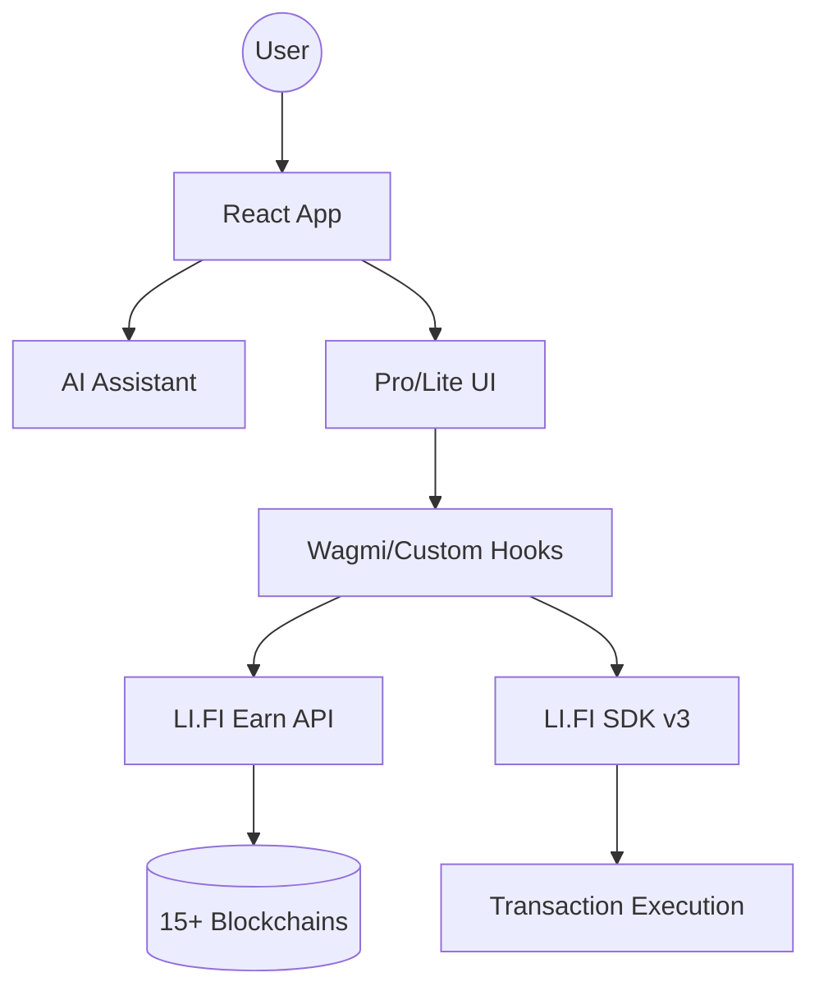

# 🛸 LI.FI Yield Explorer

**The Ultimate Omni-Chain Yield Discovery & Execution Engine.**

[](https://vitejs.dev/)
[](https://reactjs.org/)
[](https://www.typescriptlang.org/)
[](https://li.fi)

---

## 📖 Overview

LI.FI Yield Explorer is a professional-grade DeFi dashboard designed to simplify the fragmented landscape of omni-chain yield. Built on top of the powerful **LI.FI Earn API**, it enables users to discover, compare, and deposit into 1000+ vaults across 15+ chains with a single click.

Whether you are a retail user looking for "Lite" simplicity or a treasury manager requiring "Pro" analytics, this dashboard bridges the gap between complex cross-chain infrastructure and intuitive user experience.

---

## ✨ Key Features

### ⚡ Omni-Zap™ Technology
The crown jewel of our execution engine. **Omni-Zap™** allows you to deposit any asset from any chain into any vault on any target chain in a single atomic transaction. No manual bridging, no multi-step swapping—just select your source token and "Teleport" into yield.

### 🛡️ Real-Time Trust Scoring
We don't just show APY; we show **Risk**. Every vault is put through our proprietary scoring algorithm that evaluates:
- **TVL Depth**: Total Value Locked thresholds.
- **APY Stability**: Historical volatility vs. current rates.
- **Protocol Trust**: Audited track record of the underlying protocol.
- **Liquidity/Time-locks**: Instant vs. delayed redemption windows.
*Vaults are graded A-F for instant readability.*

### 🤖 AI Yield Assistant
A specialized NLP assistant that understands DeFi. Ask it:
- *"What are the safest stablecoin yields on Base?"*
- *"Find the highest APY for ETH on Arbitrum."*
- *"Show me some aggressive high-reward options."*
The assistant uses deterministic live data to ensure 0% hallucination and 100% accuracy.

### 📊 Pro Dashboard & Portfolio
Professional portfolio tracking with:
- **Unified Positions List**: All your yields across all chains in one clean view.
- **Global Stats**: Real-time aggregated TVL, average APY, and platform-wide metrics.
- **Dynamic Charts**: Visualizing yield opportunities across the entire ecosystem.

---

## 🛠️ Architecture



### Tech Stack
- **Framework**: Vite + React + TypeScript
- **State/Hooks**: Wagmi + Viem (Type-safe Ethereum interactions)
- **API/SDK**: LI.FI Earn API + LI.FI SDK
- **Animations**: Framer Motion
- **Icons**: Lucide React

---

## 🚀 Getting Started

### Prerequisites
- Node.js (v18+)
- A [LI.FI Integrator ID](https://li.fi/plans/)

### Installation

1. **Clone the repository**
   ```bash
   git clone https://github.com/your-repo/lifi-yield-dashboard.git
   cd lifi-yield-dashboard
   ```

2. **Install dependencies**
   ```bash
   npm install
   ```

3. **Configure Environment Variables**
   Create a `.env` file in the root:
   ```env
   VITE_LIFI_INTEGRATOR_ID=your_id_here
   ```

4. **Start Development**
   ```bash
   npm run dev
   ```

---

## 📁 Project Roadmap

- [x] **Phase 1**: Core Discovery Engine (Filters, Sorting, Live APY)
- [x] **Phase 2**: Wallet Integration & Omni-Zap™ Execution
- [x] **Phase 3**: Trust Scoring & Advanced Risk Metadata
- [x] **Phase 4**: Pro Portfolio Dashboard & UI Overhaul
- [x] **Phase 5**: AI Yield Assistant NLP Integration
- [ ] **Phase 6**: Historical APY Sparklines & Performance Attribution
- [ ] **Phase 7**: Institutional Treasury Tools & Batch Deposits

---

## 📄 License

This project is licensed under the MIT License - see the [LICENSE](LICENSE) file for details.

---

**Built with ❤️ for the DeFi ecosystem using [LI.FI](https://li.fi).**
